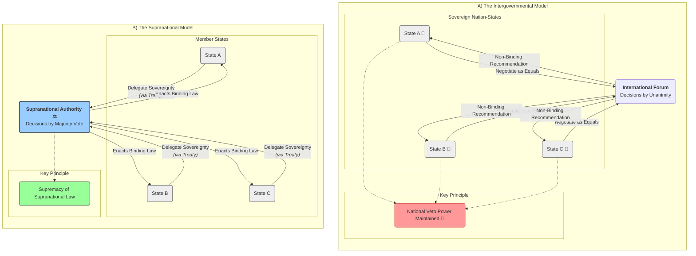

```mermaid
graph TD
    subgraph "A) The Intergovernmental Model"
        direction TB
        
        subgraph "Sovereign Nation-States"
            S1("State A 🔑")
            S2("State B 🔑")
            S3("State C 🔑")
        end

        Forum("<b>International Forum</b><br>Decisions by Unanimity")
        
        subgraph "Key Principle"
             Veto("National Veto Power Maintained 🚫")
        end

        S1 & S2 & S3 -->|Negotiate as Equals| Forum
        Forum -->|Non-Binding Recommendation| S1 & S2 & S3
        S1 & S2 & S3 -.-> Veto
    end

    subgraph "B) The Supranational Model"
        direction TB

        subgraph "Member States"
            MS1("State A")
            MS2("State B")
            MS3("State C")
        end

        Authority("<b>Supranational Authority ⚖️</b><br>Decisions by Majority Vote")
        
        subgraph "Key Principle"
            Supremacy("Supremacy of Supranational Law")
        end
        
        MS1 & MS2 & MS3 -- "Delegate Sovereignty<br><i>(via Treaty)</i>" --> Authority
        Authority -- "Enacts Binding Law" --> MS1 & MS2 & MS3
        Authority -.-> Supremacy
    end

    style S1 fill:#eee,stroke:#333
    style S2 fill:#eee,stroke:#333
    style S3 fill:#eee,stroke:#333
    style Veto fill:#f99,stroke:#c00
    style MS1 fill:#eee,stroke:#333
    style MS2 fill:#eee,stroke:#333
    style MS3 fill:#eee,stroke:#333
    style Authority fill:#9cf,stroke:#333,stroke-width:2px
    style Supremacy fill:#9f9,stroke:#333
```
